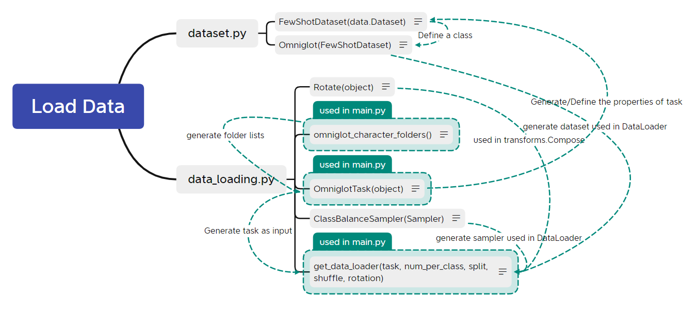
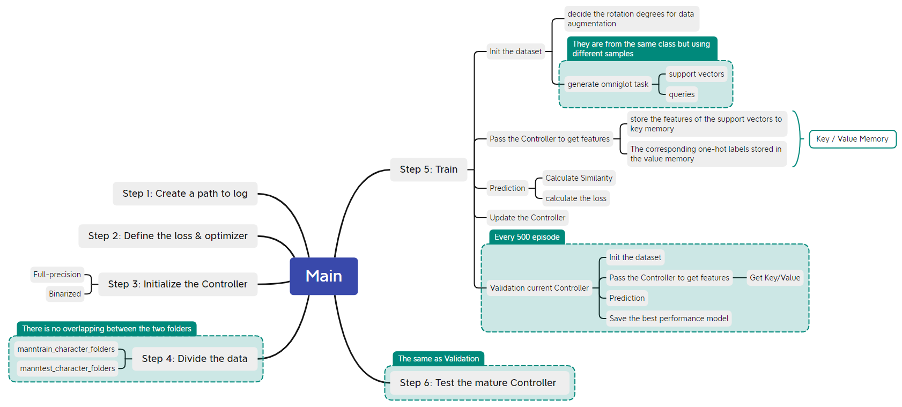
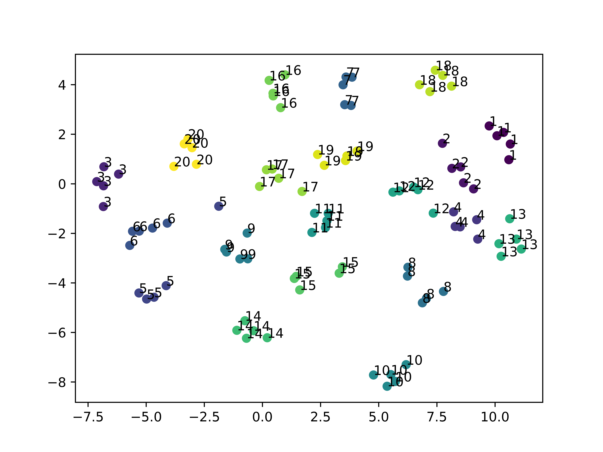
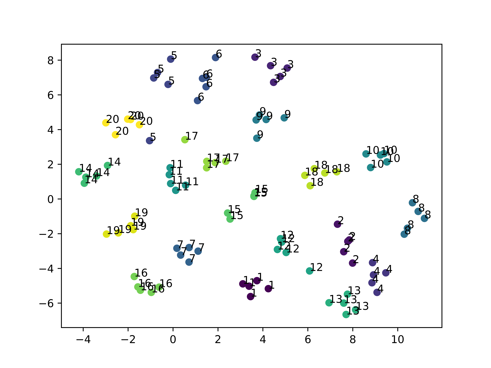
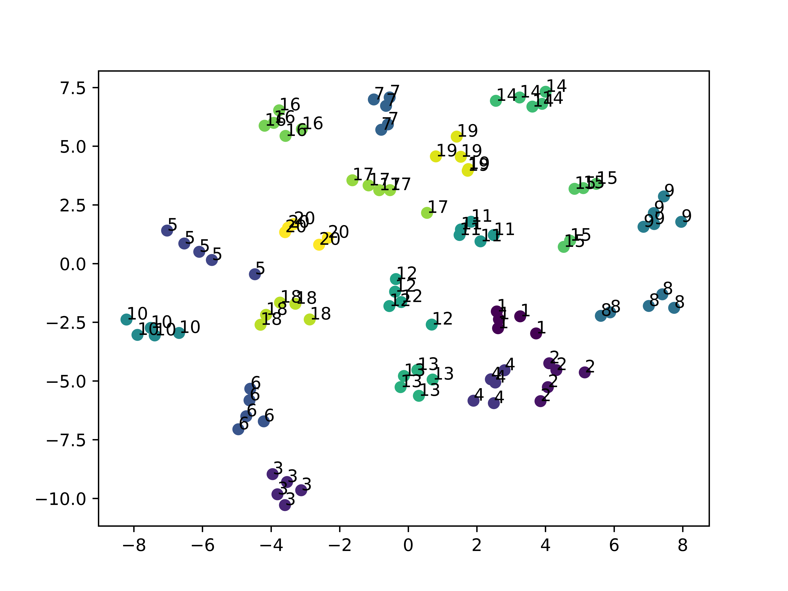
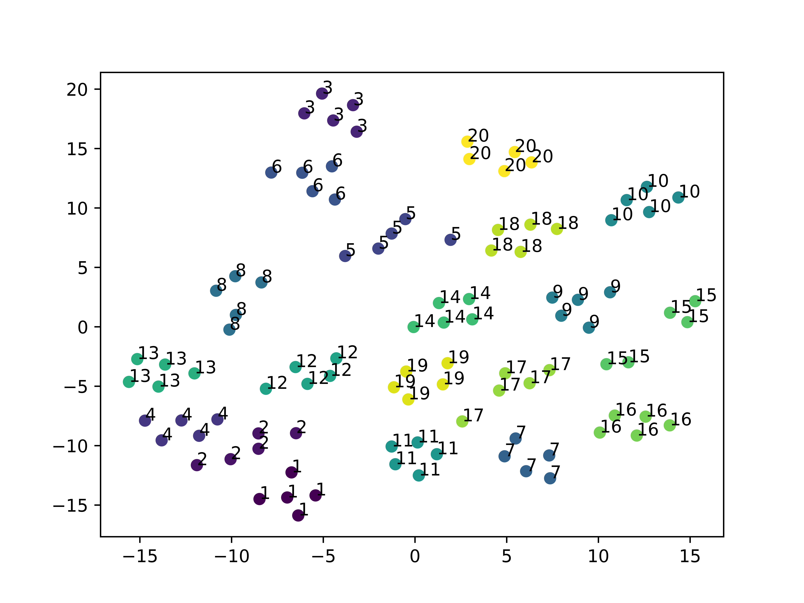
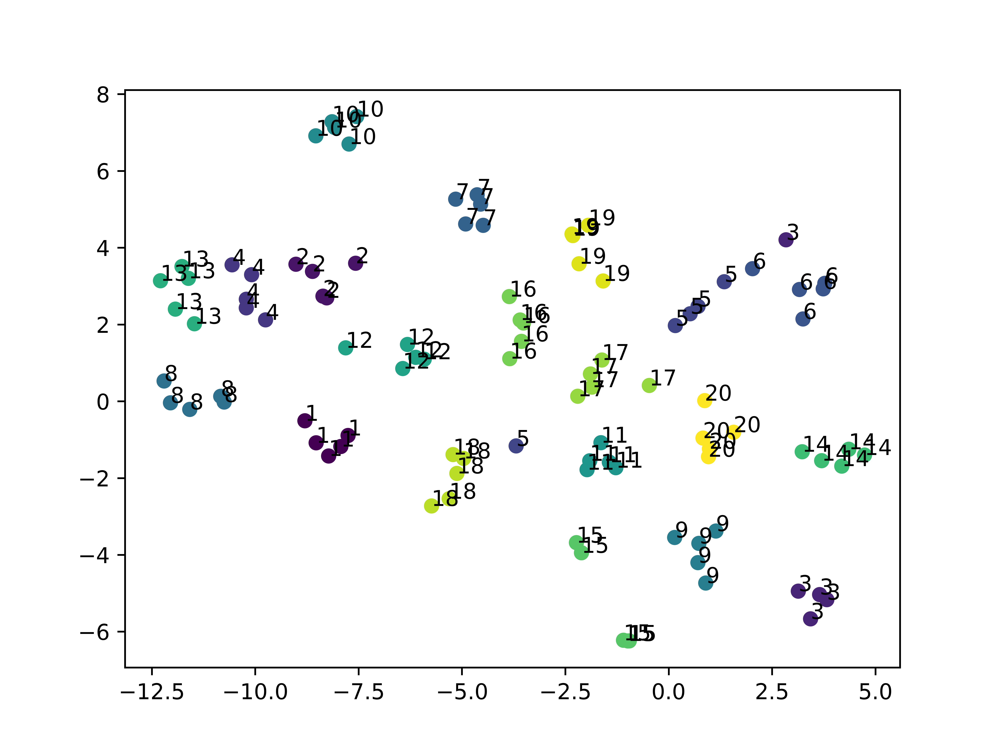
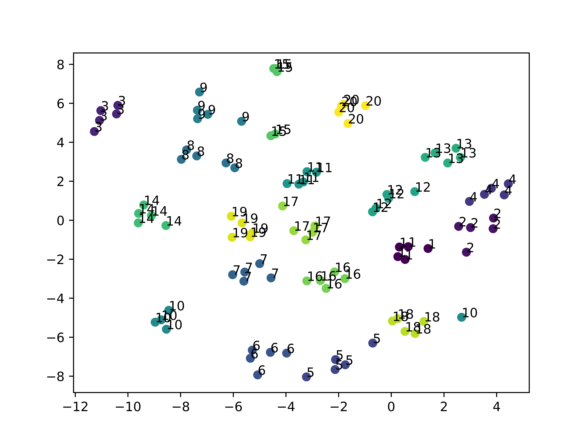
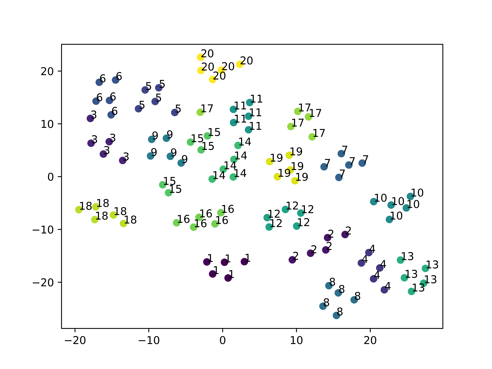
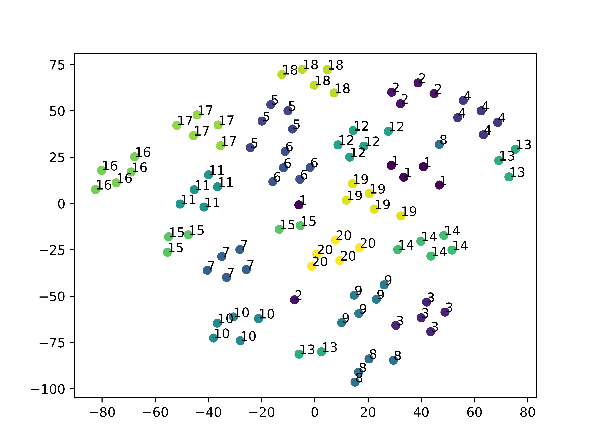

# BATMANN: A Binarized MANN for Few-Shot Learning

This is a PyTorch implementation of the MANN described in [Robust high-dimensional memory-augmented
neural networks](https://doi.org/10.1038/s41467-021-22364-0). In addition, we provide a binary version MANN, whose controller is trained as a binary neural network (BNN) in an end-to-end way, and the feature vectors stored in the key memory are binarized as well.

## Codes Structure
The two figures below illustrate the relations among different functions, which also help understand how the MANN work.

### Data Loading


### Learn & Inference

## Running Codes
In this code, you can run the MANN on omniglot dataset, obtaining a full-precision or a binarized mature Controller. We provide scripts in ``` ./scripts ``` and the checkpoints in ``` ./log ``` , which lead to easy running of our codes. 

### Installation
This code is tested on both PyTorch 1.2 (cuda 11.2).
```
git clone https://github.com/RuiLin0212/BATMANN.git
pip install -r requirements.txt
```
### Learn and Evaluate a Controller
We provide the scripts to learn a full-precision and a binary controller in ```./scripts``` , respectively. You can modify the ```--data_dir```, and simply run ```sh ./scripts/full_precision.sh``` / ```sh ./scripts/binary.sh```. Then you can get mature controllers for 5-way 1-shot, 20-way 5-shot, and 100-way 5-shot problems. Or you can modify more arguments according to your needs and specific problems. For omniglot dataset, it is worth nothing that the following requirements should be satiesfied：
+ num_shot + pool_query_train + pool_val_train <= 20
+ pool_query_train >= batch_size_train
+ pool_val_train >= val_num_train
+ num_shot + pool_query_test <= 20
+ pool_query_test >= batch_size_test 

```
python main.py \
--log_dir [The path to store the training log file.] \
--data_dir [The absolute path to the dataset.] \
--input_channel [Number of input channel of the samples.] \
--feature_dim [The dimension of the feature vectors.] \
--class_num [m in the m-way n-shot problem.] \
--num_shot [n in the m-way n-shot problem.] \
--pool_query_train [Number of samples in each class to sample the queries in the training phase.] \
--pool_val_train [Number of samples in each class to sample the validation samples in the training phase.] \
--batch_size_train [Number of queries in each class in the training phase.] \
--val_num_train [Number of validation samples in each class in the training phase] \
--pool_query_test [Number of samples in each class to sample the queries in the inference phase.] \
--batch_size_test [Number of queries in each class in the inference phase.] \
--train_episode [Number of episode during training.] \
--log_interval [Number of intervals to log the training process.] \
--val_episode [Number of episode during validation.] \
--val_interval [Number of intrvals to do validation.] \
--test_episode [Number of episode during inference.] \
--learning_rate [Initial learning rate for the optimizer.] \
--quantization_learn [Do binarized training in learning phase or not.] \
--quantization_infer [Do binarized training in inference phase or not.] \
--rotation_update [Argument for RBNN] \
--a32 [Argument for RBNN] \
--test_only [Use pretrained parameters to do inference directly or not.] \
--pretrained_dir [The path to the pretrained parameters.] \
--sim_cal [Choose cos or dot similarity] \
--binary_id [Bipolar or Binary] \
--gpu [ID of the GPU to use]
```

### Inference Only
For the ease of reproducibility, we also provide the checkpoints for mature Controller. To do inference directly, you can modify ```--data_dir``` and ```---pretrained_dir```, then run ```sh ./scripts/check_pretrained.sh```. Or you can modify more arguments:

```
python main.py \
--log_dir [The path to store the training log file.] \
--data_dir [The absolute path to the dataset.] \
--input_channel [Number of input channel of the samples.] \
--feature_dim [The dimension of the feature vectors.] \
--class_num [m in the m-way n-shot problem.] \
--num_shot [n in the m-way n-shot problem.] \
--pool_query_test [Number of samples in each class to sample the queries in the inference phase.] \
--batch_size_test [Number of queries in each class in the inference phase.] \
--test_episode [Number of episode during inference.] \
--quantization [Do binarized training or not.] \
--test_only [Use pretrained parameters to do inference directly or not.] \
--quantization_learn [Do binarized training in learning phase or not.] \
--quantization_infer [Do binarized training in inference phase or not.] \
--rotation_update [Argument for RBNN] \
--a32 [Argument for RBNN] \
--test_only [Use pretrained parameters to do inference directly or not.] \
--pretrained_dir [The path to the pretrained parameters.] \
--sim_cal [Choose cos or dot similarity] \
--binary_id [Bipolar or Binary] \
--gpu [ID of the GPU to use]
```

## Experimental Results
For clarification, we use the table below to show the setting details of different experiments. **The upper and lower tables are the details for learning and inference phases, respectively.** Binary-1 means the elements are selected in {-1, 1}. On the other hand, Binary-2 means the element only contains 0 and 1.

| **Learning** Settings | Options | Nat | 1<span id="1"></span> | 2<span id="2"></span> | 3 | 4 | 5 | 6 | 7 | 8 | 9 | 10 |
|:---:|:----:|:----:|:----:|:---:|:---:|:---:|:---:|:---:|:----:|:----:|:----:|:----:|
| Controller | Full-precision | √ | √ | | √ | √ | √ | √ |
| | XNOR | | | √ | | | | | √ | √ |
| | RBNN | | | | | | | | | | √ | √ |
| Sharpening | Softabs | √ | √ | √ | √ | √ | | | √ | | √ |
| | softmax  | | | | | | √ | √ | | √ | | √ |
| Similarity | Cosine | √ | √ | √ | √ | √ | √ | √ | √ | √ | √ | √ |
| | Dot | | | |
| Key vectors | Full-precision |√ | √ | | √ | √ | √ | √ |
| | Binary-1 ({-1, 1}) | | | √ | | | | | √ | √ | √ | √ |
| | Binary-2 ({0, 1}) | | | | |

| **Inference** Settings | Options | Nat | 1<span id="1"></span> | 2<span id="2"></span> | 3 | 4 | 5 | 6 | 7 | 8 | 9 | 10 |
|:---:|:----:|:----:|:----:|:---:|:---:|:---:|:---:|:---:|:----:|:----:|:----:|:---:|
| Similarity | Cosine | | √ | √ | |
| | Dot | √ | | | √ | √ | √ | √ | √ | √ | √ | √ |
| Key vectors | Full-precision | | √ | | |
| | Binary-1 ({-1, 1}) | √ | | √ | √ | | √ | | √ | √ | √ | √ |
| |Binary-2 ({0, 1}) | | | | | √ | | √ |

### End-to-End full-precision and binarized MANN
+ The 2nd column is the results reported in the Supplementary Table II in the [Nat Comm paper](https://arxiv.org/pdf/2010.01939.pdf).
+ The 3rd column is the results obtained by our implementation. The Controller is trained in an end-to-end full-precision scheme. The weights and the features stored in the Key Memory are all in full-precision format.
+ The 4th column is the results obtained by our implemententaion. The Controller is trained in an end-to-end binarized ({-1,1}) scheme. The weights and features stored in the Key Memory are all in a binarized format ({-1,-1}). (Note: The first conv layer & the last fc layer are 8-bit, we use a sign function at the end to get the binarized outputs.)

| Problem | Full-Precision ([Nat Comm](https://doi.org/10.1038/s41467-021-22364-0)) | Full-Precision[ (S1)](#1) | Binary-1[ (S2)](#2) | 
|:---:|:---:|:----:|:----:|
| 5-way 1-shot | 97.44% | 95.25% ([ckpt](./log/log_full_precision_5_1/model_best.pth)) | 94.40% ([ckpt](./log/log_binary_5_1/model_best.pth)) |
| 20-way 5-shot | 97.79% | 97.64% ([ckpt](./log/log_full_precision/model_best.pth)) | 95.11% ([ckpt](./log/log_binary/model_best.pth)) |
| 100-way 5-shot | 93.97% | 95.68% ([ckpt](./log/log_full_precision_100_5/model_best.pth)) | 94.32% ([ckpt](./log/log_binary_100_5/model_best.pth)) |

### Ablation Study on 20-way 5-shot Problem
| Experiments | S3 |  S4 |  S5 |  S6 |  S7 |  S8 |  S9 |  S10 |
|:----:|:----:|:----:|:----:|:----:|:----:|:----:|:----:|:----:|
| Accuracy | 95.56% | 42.28% | 54.77% | 13.91% | 95.49% | 96.45% | 96.30% | 95.97% |


#### t-SNE
**Tips**: The same number in different figures can represent different characters in Omniglot dataset. 

S3


S4


S5


S6


S7


S8


S9 


S10


#### FGSM Attack （epsilon = 0.1）
| Experiments | S3 |  S4 |  S5 |  S6 |  S7 |  S8 |  S9 |  S10 |
|:----:|:----:|:----:|:----:|:----:|:----:|:----:|:----:|:----:|
| Acc. (%) | 

More results will be avaliable soon.


## Acknowledgement
This code is ispired by [LearningToCompare_FSL](https://github.com/floodsung/LearningToCompare_FSL). We thanks for this open-source implementations.


